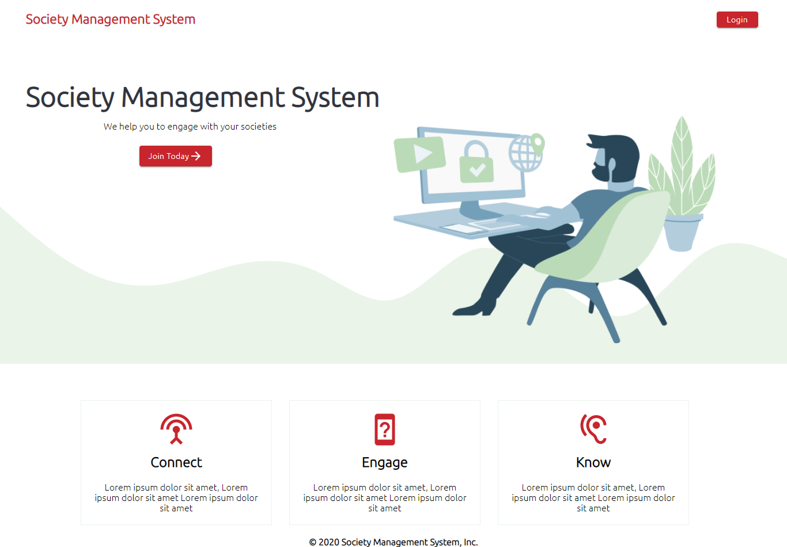
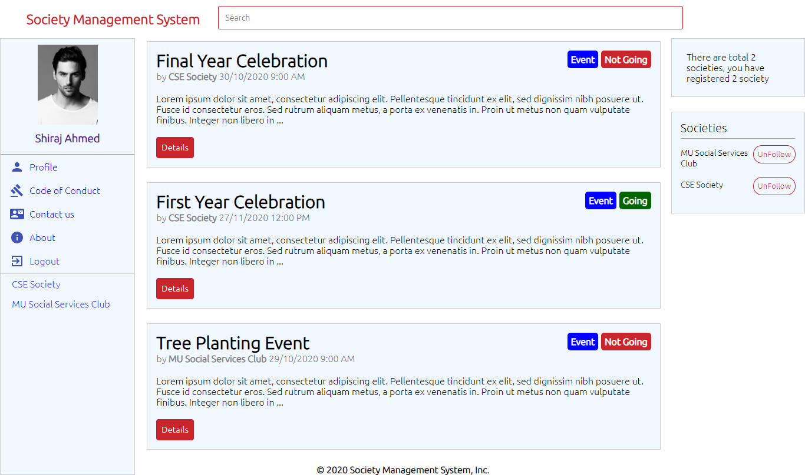
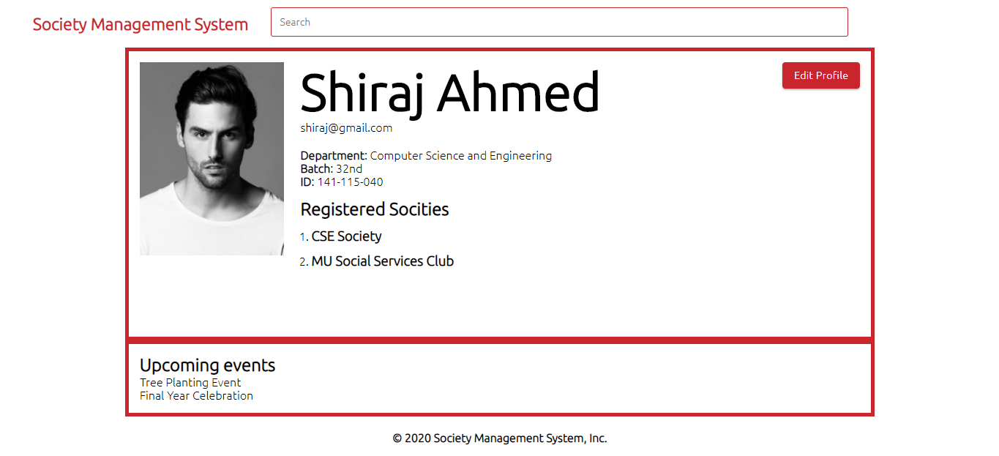
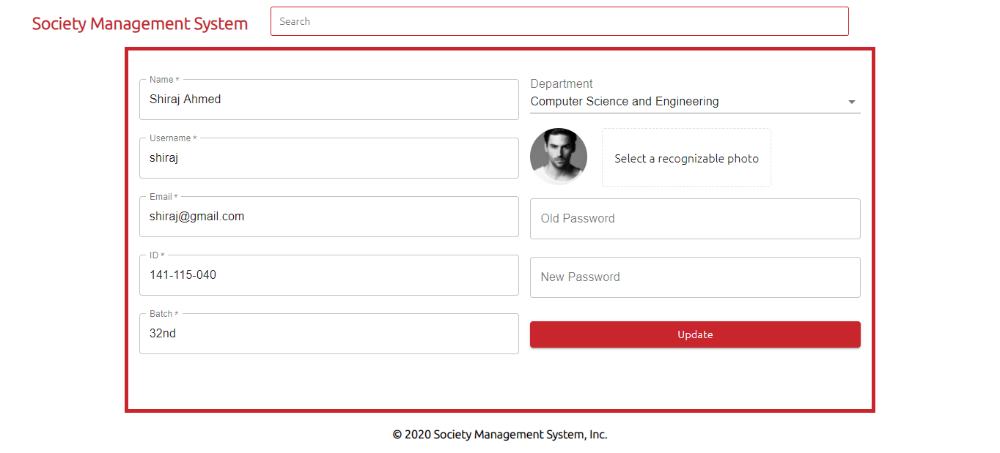
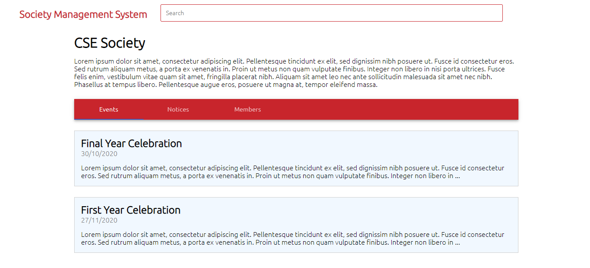
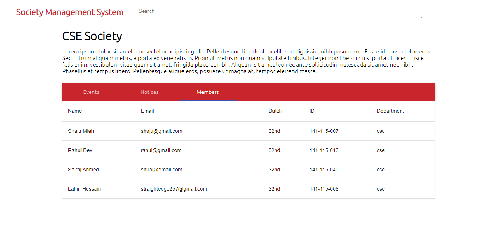

# Society Management System of a College

### MCA Mejor Project

An application that can gather all the informations for a perticular society of a College and show it to authenticated students of college. Students can see every informations related that society.

In a College there are different types of societies(clubs) where student shuld connect and engage with different activities to learn new skills and increase their knowledge.

our application can help stidents to engage with societies of a college.

## Stack Used

Server Side

- Node.js
- Express
- Bcrypt.js, JSONWebToken(authentication)
- Express Fileupload(uploading image)
- NodeMailer(sending email)

Database

- MongoDB/Mongoose
<!-- - Redis -->

Client Side

- React
- Context(for state management)
- Material UI(ui component)
- React Testing Library(testing components, DOM elements, Snapshot)
- React.memo(for memoization a pure component)

Others

- Eslint
<!-- - Prettier -->

<!-- </img>
</img>
</img>
</img>
</img>
</img>  -->
